## Brief Guide to Using the PMD DataPortal
**Authors:** Alexander Straumal, Marina Shakiba, Juliane Schleifer, Marian Bruns, Michael Luke

**Creation Date:** 25-03-19

**Last updated:** 2025-03-26 by JS

**Contact:** t.b.d.

Hello MaterialNeutral1 Projects,

The PMD Data Portal serves the sustainable storage of your project data. Here you will find a brief guide that shows how you can utilize the key functions of the PMD Data Portal. This is explained through 3 user stories. User Story 1 demonstrates how to search for data and explore the Data Portal. User Story 2 is dedicated to consuming or downloading datasets. User Story 3 focuses on how to deposit your own datasets in the Data Portal. Additionally, example formats for data storage are provided. Beyond these simple user stories, the Data Portal offers many additional features to generate semantic descriptions and knowledge graphs of your data, as well as to store them in RDF format in a Fuseki triple store. If you are interested in this, please feel free to contact us directly or utilize the offered web meetings (dates will be arranged). Good luck with using the PMD Data Portal.

## About DataPortal

Welcome to the MaterialDigital DataPortal - your one-stop-shop for uploading, managing and sharing material datasets! 

In a world where FAIR data plays an increasingly important role, we offer you a user-friendly 'portal' where you can share and organize your data securely and efficiently. The MaterialDigital platform team has been working with the MaterialDigital community since 2019 to develop de facto standards. These can be used across domains in the area of semantic interoperability, workflows and IT architecture and infrastructure in materials science and tool technology. 

We know that handling and sharing (large) amounts of data can be challenging. That's why we offer you our DataPortal: This builds on the intuitive interface of CKAN. It allows you to upload, categorize and manage your datasets with ease. Whether you are a researcher, a company or a data enthusiast, our platform is designed to meet your needs to find and use shared datasets.

Our features include:

- Easy data management: upload your datasets in different formats and manage them in one place.

- Secure storage: Your data is safe with us. We use the latest security standards to protect your information

- Flexible sharing: Share your data sets with colleagues or the public, according to your needs.

- Analytical tools: Use our integrated tools to analyze your data and gain valuable insights.

At MaterialDigital, we believe in the power of FAIR data and shared structures and approaches.

Join our community and experience how easy and effective data management can be!

Your PMD Team 

Contact us here for more information, support and exchange.

## Creating a User Account

In order to use the user specific functinalities (e.g.  Data upload, creation of groups, ...) of the DataPartal you first need to create an account on the PMD Website.

The direct link to the SingUp Page can be found [here](https://www.material-digital.de/signup/). 

There you will be guided through the sing up process and relevant data is inquired.

The same credentials are then used when you want to sign into the [DataPortal] (https://kit-pmd-4.ydns.eu/user/login). Use the button Sign in with SSO and the information for the PMD SSO are taken over as they are saved within the PMD SSO.

 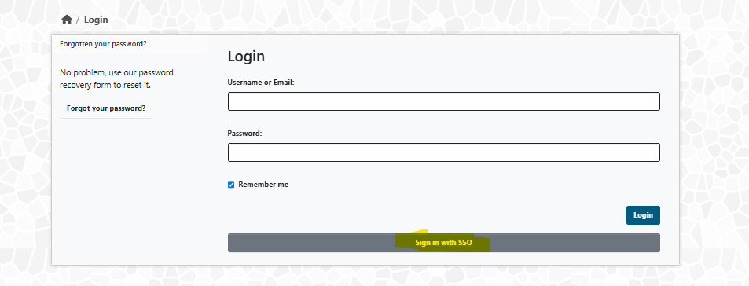

## User Stories

### User Story 1

> As a visiting user, I would like to explore what kind of material data I can find on the PMD Data Portal and if there is data available for the material I am interested in.

#### Landing Page DataPortal
If you enter the following address in your browser, you will be directed to the MaterialDigital DataPortal: [https://kit-pmd-4.ydns.eu/](https://kit-pmd-4.ydns.eu/)

The Log In button in the right-hand corner indicates that you are a visiting user with limited access to the DataPortal. If you would like to access the site as a registered user, please go to the following section to find out how to register: Link to section.
 

On the landing page you have different options for searching the datasets of the DataPortal.

#### Free text search bar
If you have already a specific topic in mind that you would like to explore, just use the free text search bar. You can use the free text search bar for an unfiltered search of our datasets. When using the search function, please note the following points: There is no translation available, the keywords will be found in the language in which the dataset was created. We recommend that you enter your search in English. Use quotation marks "" to search or filter for an exact word or group of words. You will get a better match. (Funktion nochmal prüfen!)

#### Pre-filtered search

Our DataPortal also offers you a pre-filtered search. Simply click on the following areas to start a search:

- **Datasets** - This search will list all published datasets
  
- **Resources** - This search includes all resources contained in the datasets
  
- **Organizations** - This search will show you the providers of the datasets

By clicking on the respective search field, you can directly access the results of the database. The overview functionalities and keywords can be used to “browse” the website and familiarize yourself with the published datasets and resources.

#### Filter - Datasets
Clicking on **datasets** will display all available datasets. To further narrow your search: use the tags and filter options on the left sidebar.

#### Filter - Resources
Clicking on **resources** will display all the individual files that are part of the datasets uploaded to the DataPortal. They hold the data itself.

#### Filter - Organizations
Use this function to discover the datasets provided by a certain organization. Full names and partial names (e.g. Kupfer for KupferDigital) lead to the desired result.

#### Filter - Tags
On the landing page, you will also find the most common tags related to the available data set. Click on the tag to directly display all results for the corresponding keyword.

#### Search Results and adjust filters
Whether you entered a search term yourself or clicked a tag, all results are displayed in a list. Sorted by the highest match. With the help of the sidebar, the search can be further fine-tuned. E.g. Formats, or specific organizations can be narrowed down further.

You can now also sort the results displayed by relevance, name or date last edited. 

Your selected filters can be deselected by clicking on the “x”. 

By clicking on the desired dataset in the main display area further information about the dataset will be provided.

#### Final Remarks: 
If there are any questions in regards to CKAN along the way there is always the chance to explore the CKAN Website, which can either be found here (https://ckan.org/) or at the bottom of the DataPotal page under Powered by ckan.

### User Story 2:
As a visiting user, I found some interesting datasets and I want to digest/consume them, for further analysis.

In the given scenario all functionalities are explained based on the dataset [42CrMoS4 Tensile Tests Fraunhofer IWM] (https://kit-pmd-4.ydns.eu/dataset/42crmos4-tensile-test-iwm). This dataset offers a wide range of different resources.

Once you have narrowed down your search explained in Story 1, you have several options to consume the data. 
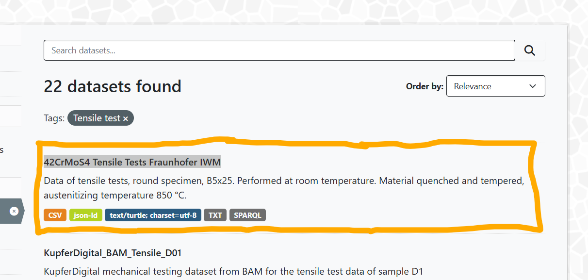

After clicking on the dataset, the “Dataset Overview Page” will appear with information about the dataset such as: 
- main contact person for the dataset
- publishing organization
- creator of the dataset
- and others

In this example, we are looking at a dataset that has been published by another person. Therefore, only the tabs Dataset and Groups are displayed. An additional "FUSEKI" tab will appear when viewing a record you have uploaded. How you can upload your own datasets will be explained in the chapter 3. 

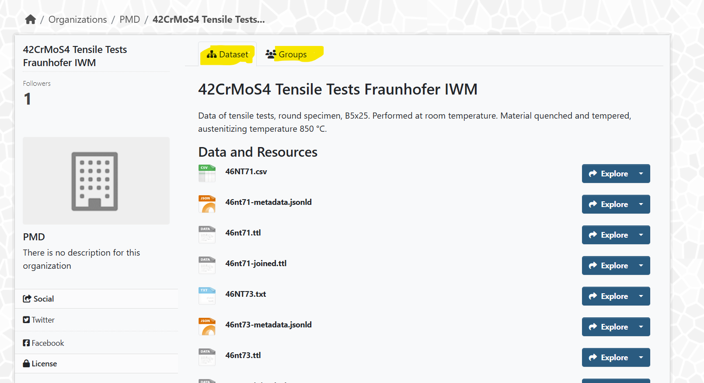

The icons associated with the resources indicate the different formats in which your the selected dataset is available. In this example we have CSV, Jason, TTL, TXT and more.

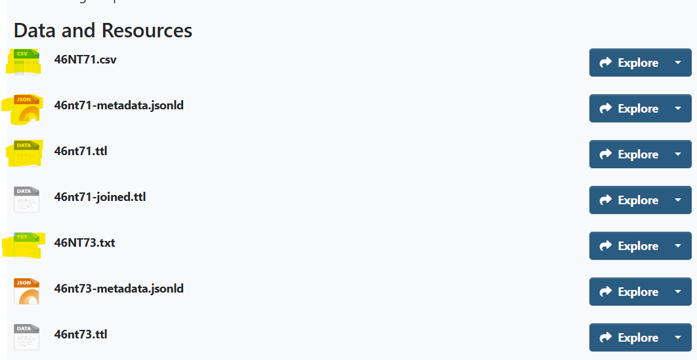

In order to get a better overview of the data the button "Explore" offers further options depending on the resource format. You can "Preview" the file in your browser, "Download" it directly, or "Create a Mapping".

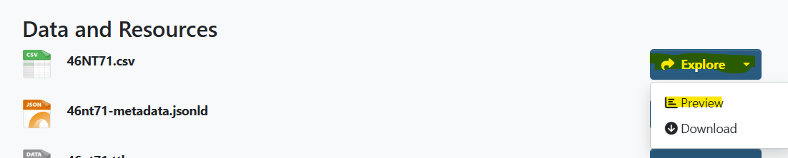
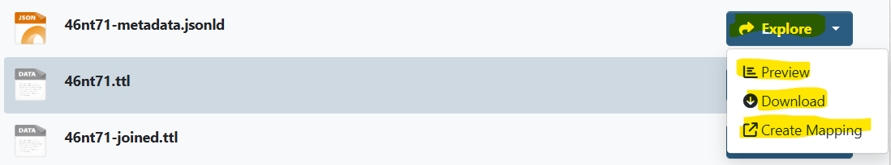

We suggest to click on the option **Preview**. Which takes you to the **Detail Page of the Dataset** and its different Resources.

The functionalities **Download** and **Create Mapping** are further explained underneath the description of the detailed page for the dataset.

#### Detail Page of Dataset: 
There are different buttons at the top of the explore page, depending on the format you selected in the previous step. The buttons shown in this example are available for CSV files. 
You will always find the URL, a short description of the record and the source code at the top of the page.
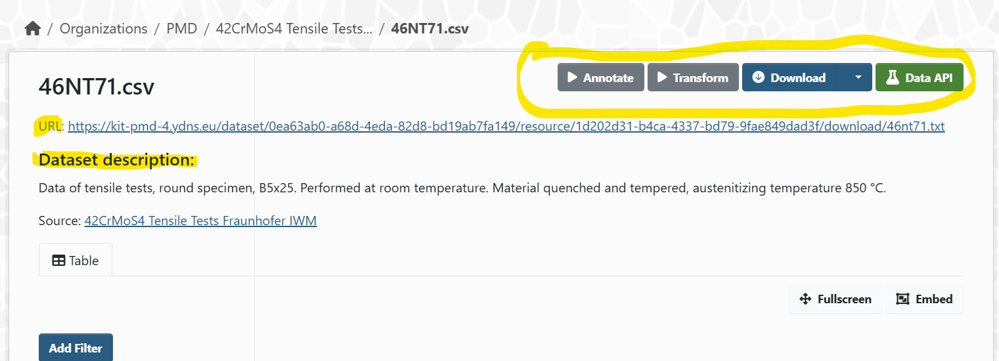

#### Functionalities of Buttons at the top of the explore page

**Annotate:**: : The process of assigning information to linguistic data (especially corpus data, with linguistic information) is called annotation. Only when this process has been completed can meaningful evaluations be made. The emphasis in this case is on the enrichment with linguistic information.

**Transform:** Run Transformation, if allowed and not done before, by clicking here a Turlk file is created. This file lists all annotations to the dataset. You can use if for further semantic operations.

**Download:** Provides a cleaned download of data. For some resource formats there is a dropdown menu embedded in the download button. Here you have the option to choose between different download format options.

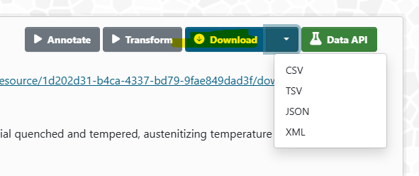

**Data API:** An API or Application Programming Interface is a messenger or a middleman that lets computer programs securely access data from one another.

#### Display Area "Preview"

Underneath the Dataset Description a preview of the data is displayed. Below shown is the preview for the CSV file but this can also vary depending on the selected format. 

#### Display Area "Resource"

Further down on the page indicated by **“Resource”** another functionality can be found. Here you can see which resource is selected and also switch between the different data formats/resources. 

#### Display Area "Data Dictionary"

The **Data Dictionary** is also an optional function which is displayed at the moment because the format CSV is selected.

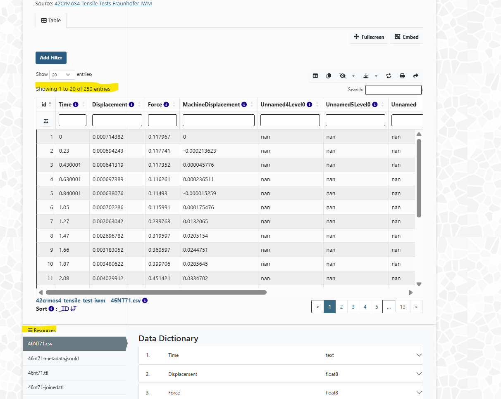

The picture below highlights two more areas of interest on the detail page. Area 1 (Resources) was already previously seen on the picture before. This area shows you which resource is currently selected. Here you have the option to switch between the different resources associated with the selected dataset. The dataset highlighted in grey is the one currently selected and all shown information on this detail page is referred to.

#### Display Area "Additional Information"

Shown area 2 – **Additional Information**- also can be found on each Detail Page of the dataset. Here is the information shown for the resource selected on the left.

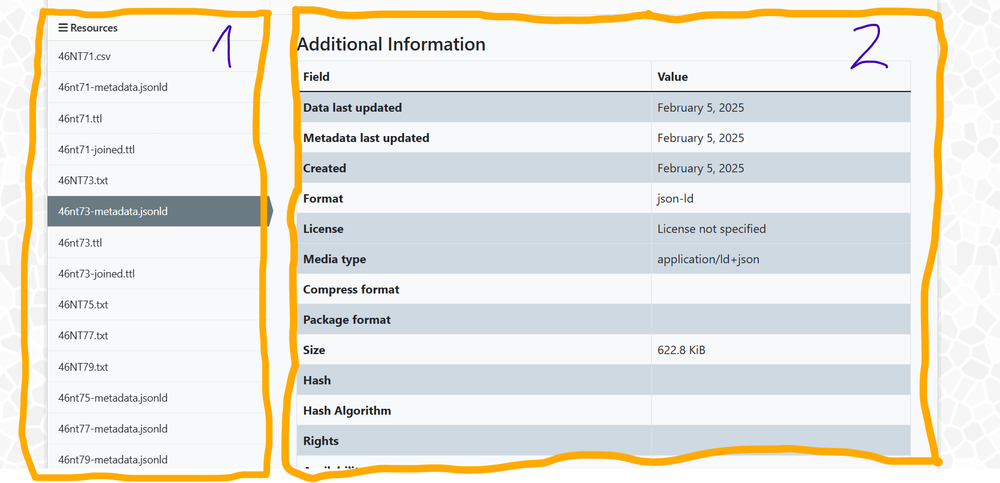

#### Direct Download

If you do not need additional information about the different resources, there is also the possibility to download resources on the **Dataset Overview Page**.
Right Clicking on Explore and selecting Download either directly starts the download or takes you to the respective data source.

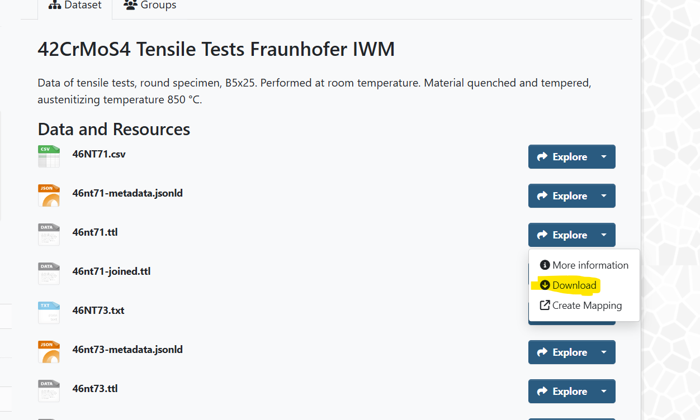

#### Create Mapping
 
 By clicking on the option **Create mapping** for a given resource of the dataset you will be guided to the following page. 
 Create a rule bases mapping by filling the form below. It will query the given metadata file and the graph template by the Class IRI set for subjects and objects. When clicking "Start Mapping" select widgets will spawn allowing you to map a subject to an object. The resulting YAML file will contain a ruleset for each of the assertions made, and when run create triples connecting the subject meeting the condition by the predicate IRI given. Download the file, make changes if needed and upload it to the "mappings" group here in CKAN if you want to make use of the automated mapping process applying the mapping.
 
 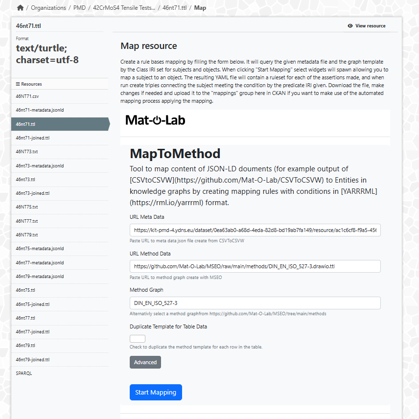
 
 #### Good to Know
 
 **Groups:** The Group functionality is relevant for looged in users. The button Groups takes you to so far established groups. You can use CKAN Groups to create and manage collections of datasets. This could be to catalogue datasets for a particular project or team, or on a particular theme, or as a very simple way to help people find and search your own published datasets. Groups are meant to be used by the community of users of a site.
 
 
 
 **Follow:**  The the Follow function is only relevant for by logged in users.

#### Final Remarks: 
If there are any questions in regards to CKAN along the way there is always the chance to explore the CKAN Website, which can either be found here (https://ckan.org/) or at the bottom of the DataPotal page under Powered by ckan.

### User Story 3:

> As a registered user, I want to add data to the central data portal and  point out the project, publisher that owns the data, to make my data findable and excessable by the public.

- Registration at "material-digital.de"
- Landing Page des DataPortals
- Getting access to Organisation
    - Admin User Story
    - Member User Story
- Uploading Files
- Access Management
    - privat/public
    - for Organisation / for Project
- Linking/citing the data
- User Profile  
    - how to reach own User Profile
    - what can be seen and what can be managed there
- membership to organizations
    - can only be part of your organization, can't request to be member of other organizations due to privacy issues
