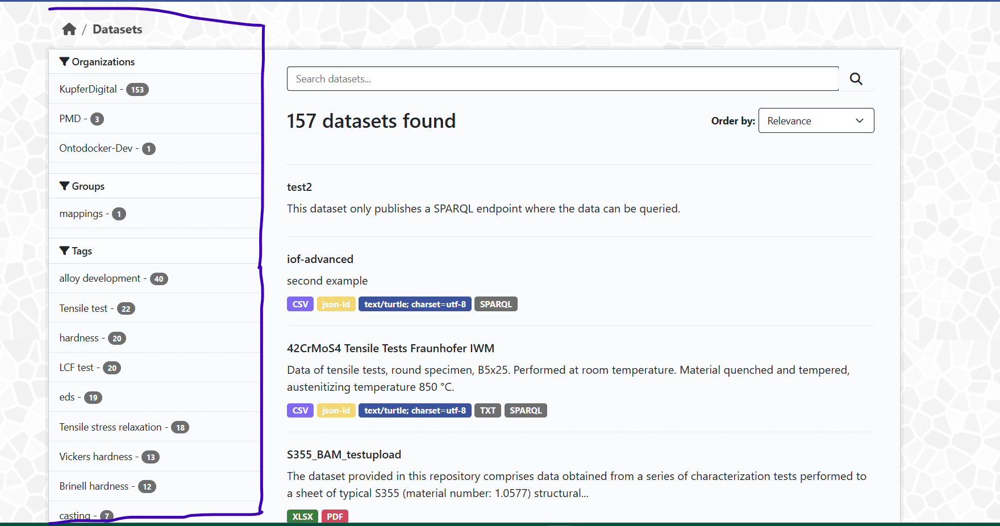
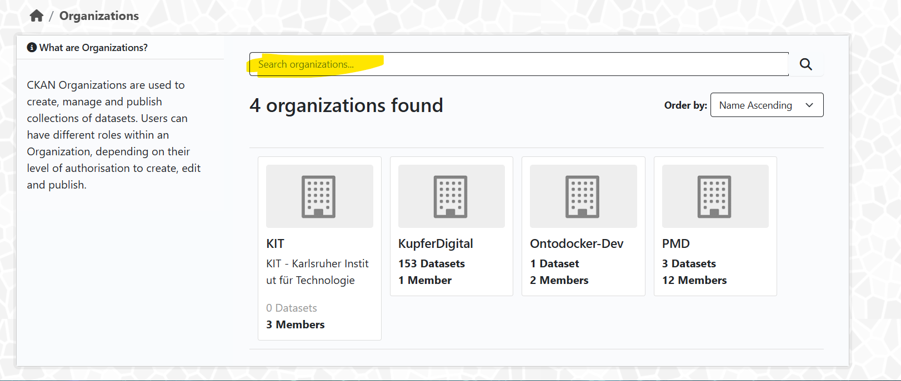
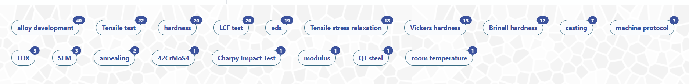
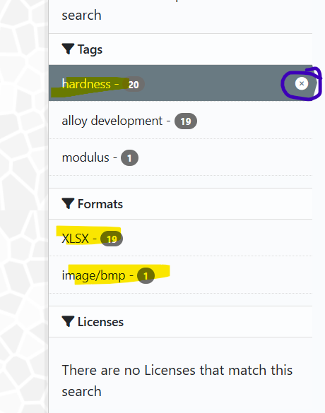
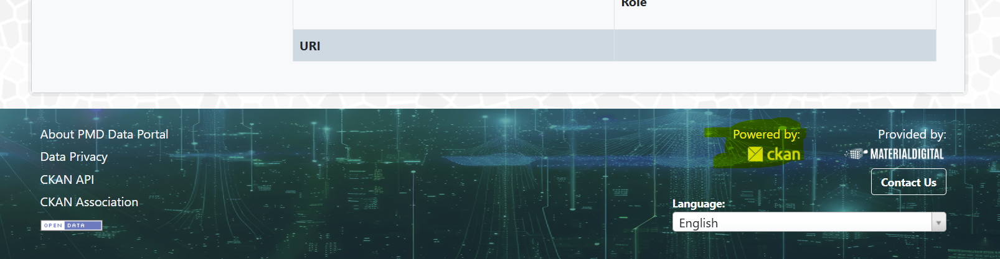
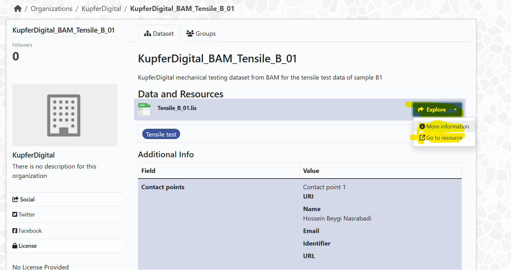
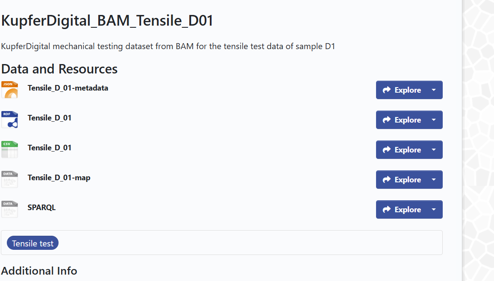
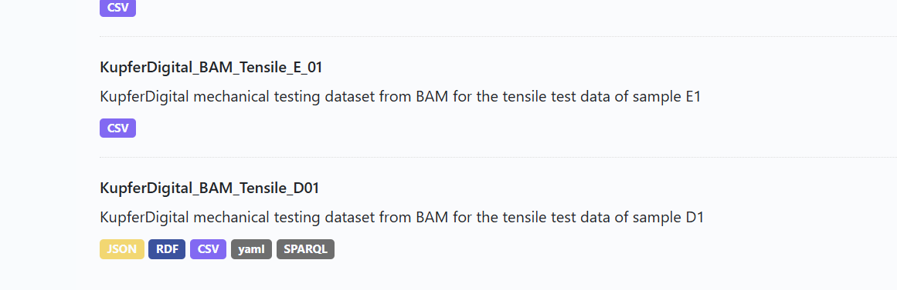
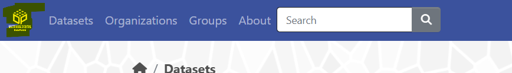
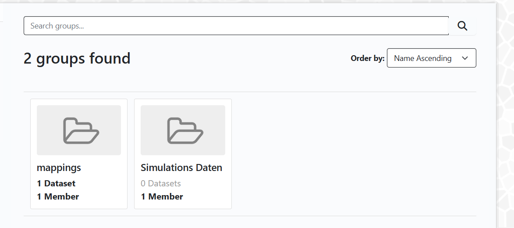

# Entwurf des Schulungsmaterial (MaterialDigital DataPortal tutorial V0.1) - Stand - 25.02.2025

## [MaterialDigital DataPortal](https://kit-pmd-4.ydns.eu/) - dev Version

[TOC]

Prio 1: Schulungmaterial für die aktuelle Version des Datenportals erstellen.
Prio 2: Verbesserungvorschläge für die Benutzerfreundlichkeit aufschreiben. Anpssung **nur** nach Freigabe vom LK und Allokation von zusätzlichen Kapa.

## Task force
- Michael Luke
- Marian Bruns - kennt sich im GitHub aus. - Data Upload?
- Marina
- Katharina
- Juliane
- Alex

## Sprache
- Englisch 

## Tasks
- Struktur schreiben
- Aufgaben verteilen.

## Structure
- About Text
- Übersicht - Link zum DataPortal - without log in
    - Übersicht der Metriken
    - Liste von häufigsten Schlagwörter
    - Suchzeile
    - Log In Option
    - Sprachauswahl - unten! - nur von Interface, Texte sind in der Sprache, in der sie angelegt wurden, entsprechend muss die Suche gemacht werden, Suchsprache muss/sollte Englisch sein 
- Search page
    - Filter option on the left sidebar
- Found data set
    - Description links
        - Titel
        - Followers - Nur für eingelogte User
        - Organisation
        - Social?
            - Statt Twitter und Facebook sollte die Organisations-Webseite versinkt sein.
        - License
    - Tabs
        - Dataset
        - Group
    - Dataset tab
        - Titel
        - Describtion
        - Data
            - Titel
            - Description
            - Explore Knopf
                - Drop-down-Pfeil
                    - Preview
                    - Download (each file can be previewed without download)
        - Liste der Keywords
        - Additional Info
            - description (done by uploader)
            - organization 
            - what is **License not specified** saying - (Logischer Bruch zwischen Organization und Licence)
- Logged in Users
    - Anmeldung auf der PMD-Webseite
- Landing im DataPortal
    - + Link with User Name
        - Dashboard
        - Profile setting
        - log out
- User Dashboard
    - My Datasets
    - My Organizations
    - My Group
    - Profile settings
- Profile settings
    - Datasets
    - Organizations
    - Groups
    - Api token - **Marian**
- Roles
    - User
        - **TBD!!!!!**  
    - Admin
        - Best practice: 
            - Auf der Seite der Organisations sollte 
            - ein kurze Beschreibung und Link der Organisations-Webpage und
            - Kontakt zum Admin der Organisation, wenn man um Mitgliedschaft anfragt.
        - Wie verwalten man die Organisationsgruppe? **TBD!!!!!**
- Data upload
    - **TBD!!!!!**

## About Text
"About" DataPortal

Willkommen beim MaterialDigital DataPortal – Ihrer zentralen Anlaufstelle für das Hochladen, Verwalten und Teilen von Material-Datensätzen! 

In einer Welt, in der FAIRE Daten eine immer wichtigere Rolle spielen, bieten wir Ihnen ein benutzerfreundliches 'Portal' an, über das Sie Ihre Daten sicher und effizient teilen und organisieren können. Das Team der Plattform MaterialDigital arbeitet seit 2019 gemeinsam mit der MaterialDigital Community an der Entwicklung von De-facto Standards. Diese können im Bereich der semantischen Interoperabilität, der Workflows und der IT-Architektur und Infrastruktur in der Materialwissenschaft und Werkzeugtechnik domänenübergreifend verwendet werden. 

Wir wissen, dass der Umgang mit und das Teilen von (großen) Datenmengen herausfordernd sein kann. Deshalb bieten Ihnen wir Ihnen unser DataPortal an: Dies baut auf der intuitiven Oberfläche von CKAN auf. Es ermöglicht Ihnen, Ihre Datensätze mit Leichtigkeit hochzuladen, zu kategorisieren und zu verwalten. Egal, ob Sie ein*e Forscher*in, ein Unternehmen oder ein*e Datenenthusiast*in sind – unsere Plattform ist darauf ausgelegt, Ihre Bedürfnisse zu erfüllen und geteilte Datensätze zu finden und zu nutzen.

Unsere Funktionen umfassen:

- Einfache Datenverwaltung: Laden Sie Ihre Datensätze in verschiedenen Formaten hoch und verwalten Sie sie an einem Ort.

- Sichere Speicherung: Ihre Daten sind bei uns sicher. Wir setzen auf modernste Sicherheitsstandards, um Ihre Informationen zu schützen.

- Flexibles Teilen: Teilen Sie Ihre Datensätze mit Kolleg*innen oder der Öffentlichkeit, ganz nach Ihren Bedürfnissen.

- Analytische Tools: Nutzen Sie unsere integrierten Tools, um Ihre Daten zu analysieren und wertvolle Erkenntnisse zu gewinnen.

Wir in der Initiative MaterialDigital glauben an die Power von FAIRen Daten und gemeinsamen Strukturen und Herangehensweisen.

Treten Sie unserer Community bei und erleben Sie, wie einfach und effektiv Datenmanagement sein kann!

Ihr PMD Team 

Kontaktieren Sie uns hier für mehr Informationen, Support und Austausch.

## User Stories

### US1:

> As a visiting user, I want to explore the data by searching and filtering the available data by keywords, categorys, compartibility and content.

#### Landing Page DataPortal
If you enter the following address in your browser, you will be directed to the MaterialDigital DataPortal: [https://kit-pmd-4.ydns.eu/](https://kit-pmd-4.ydns.eu/)

The Log In button in the right-hand corner indicates that you are a visiting user with limited access to the DataPortal. If you would like to access the site as a registered user, please go to the following section to find out how to register: Link to section.
 

On the landing page you have different options for searching the datasets of the DataPortal.

#### Free text search bar
If you have already a specific topic in mind that you would like to explore, just use the free text search bar. You can use the free text search bar for an unfiltered search of our datasets. When using the search function, please note the following points: There is no translation available, the keywords will be found in the language in which the dataset was created. We recommend that you enter your search in English. Use quotation marks "" to search or filter for an exact word or group of words. You will get a better match. (Funktion nochmal prüfen!)

#### Pre-filtered search

Our DataPortal also offers you a pre-filtered search. Simply click on the following areas to start a search:

- **Datasets** - This search will list all published datasets
  
- **Resources** - This search includes all resources contained in the datasets
  
- **Organizations** - This search will show you the providers of the datasets

By clicking on the respective search field, you can directly access the results of the database. The overview functionalities and keywords can be used to “browse” the website and familiarize yourself with the published datasets and resources.

#### Filter - Datasets
Clicking on **datasets** will display all available datasets. To further narrow your search: use the tags and filter options on the left sidebar. (Unterschied zwischen Datasets und Resources!!)

#### Filter - Resources
Clicking on **resources** will display all the individual files that are part of the datasets uploaded to the DataPortal.

#### Filter - Organizations
Use this function to discover the datasets provided by a certain organization. Full names and partial names (e.g. Kupfer for KupferDigital) lead to the desired result.

#### Filter - Tags
On the landing page, you will also find the most common tags related to the available data set. Click on the tag to directly display all results for the corresponding keyword.

#### Search Results and adjust filters
Whether you entered a search term yourself or clicked a tag, all results are displayed in a list. Sorted by the highest match. With the help of the sidebar, the search can be further fine-tuned. E.g. Formats, or specific organizations can be narrowed down further.

You can now also sort the results displayed by relevance, name or date last edited. 

Your selected filters can be deselected by clicking on the “x”. 

By clicking on the desired dataset in the main display area further information about the dataset will be provided.

Final Remarks: 
If there are any questions in regards to CKAN along the way there is always the chance to explore the CKAN Website, which can either be found here (https://ckan.org/) or at the bottom of the DataPotal page under Powered by ckan.

### US2:

> As a visiting user, I found some interesting datasets and i want to digest/consume them, for further analysis.

If you have found a dataset with resources that interest you, you have the following options. Click on **Explore** to find more information about the dataset. Clicking on **Go to resource** will start the download of the dataset in the given format (shown as a .lis file in the example image).

In the case below, only one type of format is provided:

Whereas the dataset shown below offers 5 different formats:

The formats available for each dataset can already be seen in the search results. And pre-selected with the help of the sidebar menu.

#### Navigation bar
Clicking on the Material Digital Logo takes you back to the landing page.

Clicking on Datasets, Organizations takes you to the same result as clicking on the respective buttons on the landing page.

The link **Groups** takes you to so far established groups.
You can use CKAN Groups to create and manage collections of datasets. This could be to catalogue datasets for a particular project or team, or on a particular theme, or as a very simple way to help people find and search your own published datasets.

Please note: the **Follow function** can only be used by logged in users.

#### QUESTIONS
- Initial: Which practical question needs to be answered. 
- Landing Page des DataPortals
    - Discovery by search request in the "search"-field 
        - what can you search for?
        - Benutzung des Anführungszeichen.
    - Discovery by keywords anklicken
    - Discovery by organization, resource, datasets
    - Log in
- Search page - functions on the page
    - Filter option on the left sidebar
- Access to content
    - click on dataset - what can be found: 
- Follow function only for logged-in users available

### US2 Extension by Juliane:

> As a visiting user, I found some interisting datasets and i want to digest/consume them, for further analysis.
In the given scenario all functionalities are explained based on the dataset [42CrMoS4 Tensile Tests Fraunhofer IWM] (https://kit-pmd-4.ydns.eu/dataset/42crmos4-tensile-test-iwm). This dataset offers a wide range of different resources.

Once you have narrowed down the search explained in Story 1, you will have different options to consume the data. 

After clicking on the dataset, the “Dataset Overview Page” with information in regards to the dataset like: 
- Main contact person for the dataset
- Publishing organization
- Creator of the dataset
- and others
 are displayed.

In this demonstration case we are looking at a dataset which has been published by another person. So only the tabs Dataset and Groups are displayed. If you look at a dataset which has been uploaded by you an additional tab “FUSEKI“ will be displayed.

The images in front of the resources indicate the different formats in relation to the selected dataset. In the example given we have CSV, Jason, TTL, TXT and further.

In order to get a better overview of the data the button explore offers further options depending on the resource format. 

We suggest to click on the Option **Preview**. Which takes you to the **Detail Page of the Dataset** and its different Resources.

#### Detail Page of Dataset: 
On top of the page different buttons can be found depending on the format selected in the previous step. Show are the buttons for the CSV file. A more detailed explanation of the functions of the different buttons can be found below the picture.
Also, the URL and the Dataset description can be found on top of the page. 

#### Functionalities of Buttons on Top

**Annotate:**: : The process of assigning information to linguistic data (especially corpus data, with linguistic information) is called annotation. Only when this process has been completed can meaningful evaluations be made. The emphasis in this case is on the enrichment with linguistic information.

**Transform:** Run Transformation, if allowed and not done before, by clicking here a Turlk file is created. This file lists all annotations to the dataset. You can use if for further semantic operations.

**Download:** Provides a cleaned download of data. For some resource formats there is a dropdown menu embedded in the download button. Here you have the option to choose between different download format options.

**Data API:** An API or Application Programming Interface is a messenger or a middleman that lets computer programs securely access data from one another.

#### Display Area "Preview"

Underneath the Dataset Description a preview of the data is displayed. Below shown is the preview for the CSV file but this can also vary depending on the selected format. 

#### Display Area "Resource"

Further down on the page indicated by **“Resource”** another functionality can be found. Here you can see which resource is selected and also switch between the different data formats/resources. 

#### Display Area "Data Dictionary"

The **Data Dictionary** is also an optional function which is displayed at the moment because the format CSV is selected.

The picture below highlights two more areas of interest on the detail page. Area 1 (Resources) was already previously seen on the picture before. This area shows you which resource is currently selected. Here you have the option to switch between the different resources associated with the selected dataset. The dataset highlighted in grey is the one currently selected and all shown information on this detail page is referred to.

#### Display Area "Additional Information"

Shown area 2 – **Additional Information**- also can be found on each Detail Page of the dataset. Here is the information shown for the resource selected on the left.

#### Direct Download

If you do not need additional information about the different resources, there is also the possibility to download resources on the **Dataset Overview Page**.
Right Clicking on Explore and selecting Download either directly starts the download or takes you to the respective data source.

#### Final Remarks

If there are any questions in regards to CKAN along the way there is always the chance to explore the CKAN Website, which can either be found here (https://ckan.org/) or at the bottom of the DataPotal page under **Powered by ckan**.

### US3:

> As a registered user, I want to add data to the central data portal and  point out the project, publisher that owns the data, to make my data findable and excessable by the public.

- Registration at "material-digital.de"
- Landing Page des DataPortals
- Getting access to Organisation
    - Admin User Story
    - Member User Story
- Uploading Files
- Access Management
    - privat/public
    - for Organisation / for Project
- Linking/citing the data
- User Profile  
    - how to reach own User Profile
    - what can be seen and what can be managed there
- membership to organizations
    - can only be part of your organization, can't request to be member of other organizations due to privacy issues
